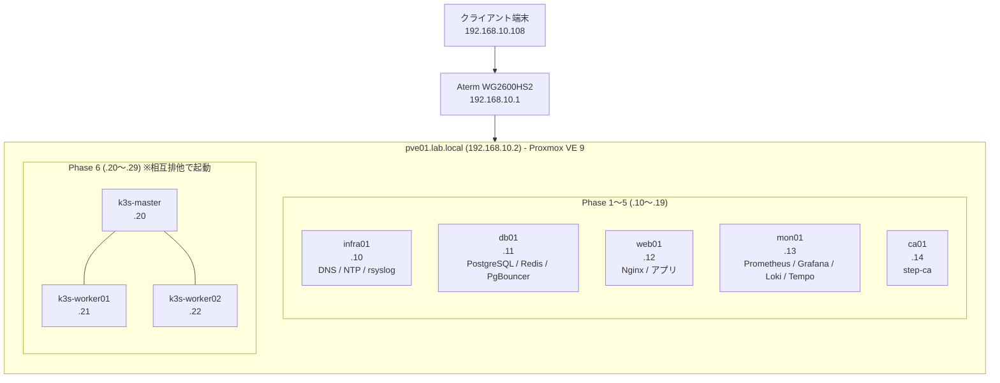

# Architecture

このリポジトリで構築するhomelabの全体構成と、主要な設計判断の根拠をまとめる。

## 目的

学習目的の個人インフララボとして、以下を達成する:

- Proxmox上のVMから始め、コンテナ化、Kubernetes化、CI/CD、監視基盤までを一貫して運用できる状態を作る
- 各レイヤの判断根拠を「実務でも同じ判断ができる」レベルで言語化する

## 物理構成

| 項目    | 値                                               |
| ------- | ------------------------------------------------ |
| ホスト  | HP 15-fc0003AU (ノートPC)                        |
| CPU     | AMD Ryzen 5 7530U (6コア12スレッド、SVM対応)     |
| RAM     | 16GB (Proxmoxホスト2GB差し引き、実質14GB)        |
| Storage | NVMe SSD 477GB (ext4 + LVM-thin、thinpool 348GB) |
| Network | USB-LANアダプタ経由の有線接続                    |
| OS      | Proxmox VE 9.1.1                                 |

既存所有のノートPCを再利用。

## ストレージ

Proxmoxの`local-lvm`(LVM-thin、348GB)を全VMの仮想ディスクに使う。ZFSではなくext4+LVM-thinを採用したのは、ノートPC内蔵SSDのWrite Amplificationを抑え、SSD寿命を優先したため。

## ネットワーク構成

### サブネット

`192.168.10.0/24` の単一セグメントで全VMを運用する。

### IPアドレス割当

| 範囲        | 用途                |
| ----------- | ------------------- |
| `.1`        | ルーター            |
| `.2-.9`     | 物理ホスト・予約    |
| `.10-.19`   | Phase 1〜5用VM      |
| `.20-.29`   | Phase 6 k3sクラスタ |
| `.30-.99`   | 将来拡張用          |
| `.101-.200` | DHCP動的プール      |

VM個別の割当は[VM Inventory](#vm-inventory)を参照。

### DNS解決

Lab内部とクライアント端末で経路を分離する。

```
[Lab内VM] ─DNS query─▶ [infra01のunbound] ─上流─▶ [ルーター/外部DNS]
[クライアント端末] ─DNS query─▶ [infra01のunbound](Lab作業時のみ) or [ルーター](通常時)
```

クライアント端末(Windowsデスクトップ)は普段ルーターのDNSを使い、Lab作業時のみPowerShellスクリプト(`scripts/dns.ps1`)で優先DNSを`infra01`に切り替える。

### NTP

`infra01`をローカルNTPサーバ(chrony)として構築済み(Phase 1)。全VMが`infra01`を参照し、`infra01`自身は上流(Ubuntu NTSプール + `nict.go.jp`)へ同期する。

## VM Inventory

全VMの OS は Ubuntu Server 26.04 LTS(cloud-init で初期化)。



| Hostname                 | IP  | Disk   | RAM    | vCPU   | Phase | 役割                                     |
| ------------------------ | --- | ------ | ------ | ------ | ----- | ---------------------------------------- |
| `pve01.lab.local`        | .2  | (host) | (host) | (host) | 0     | Proxmoxホスト                            |
| `infra01.lab.local`      | .10 | 10GB   | 1GB    | 1      | 1     | DNS (unbound), NTP (chrony), rsyslog集約 |
| `db01.lab.local`         | .11 | 30GB   | 2GB    | 2      | 2     | PostgreSQL, Redis, PgBouncer             |
| `web01.lab.local`        | .12 | 20GB   | 2GB    | 2      | 2     | Nginx, アプリケーション                  |
| `mon01.lab.local`        | .13 | 40GB   | 3GB    | 2      | 4     | Prometheus, Grafana, Loki, Tempo         |
| `ca01.lab.local`         | .14 | 10GB   | 1GB    | 1      | 2     | step-ca (内部PKI)                        |
| `k3s-master.lab.local`   | .20 | 20GB   | 2GB    | 2      | 6     | k3s control-plane                        |
| `k3s-worker01.lab.local` | .21 | 30GB   | 3GB    | 2      | 6     | k3s worker                               |
| `k3s-worker02.lab.local` | .22 | 30GB   | 3GB    | 2      | 6     | k3s worker                               |

合計リソース: Disk 190GB / RAM 17GB / vCPU 14。RAM 17GBは物理14GB上限を超えるため、Phase 5までのVMとPhase 6のk3sは相互排他で起動する。

> **現状(Phase 2 着手時点)**: 上表は各VMの目標スペック。実機は db01/web01 を **2GB RAM / 2 vCPU**(Phase 2 Step 0 でリサイズ)、infra01/mon01/ca01 は **1GB / 1 vCPU**。ディスクは全VM 32GB(テンプレート由来)。役割別リサイズは各ワークロード導入時に順次。

## 認証・セキュリティ方針

- VM管理ユーザーは全VM共通で `admin`(個人Labのため共通名で運用)
- SSH鍵認証(ed25519)、パスワード認証は全VMで無効化
- root直接SSHログインは無効化、`admin`からsudoでroot権限取得
- secret管理は`.env`+`.gitignore`で運用、本格運用は将来検討

## 運用方針

### バックアップ

- 各Phase完了時点でProxmox VM snapshotを取得(命名: `phase-N-complete`)
- 最大3〜5世代を保持、古いものは適宜削除
- 物理マシン故障時の復旧は許容

### IaC化

すべてのVM初期セットアップはPhase 1で構築するAnsible playbookで冪等に管理する。