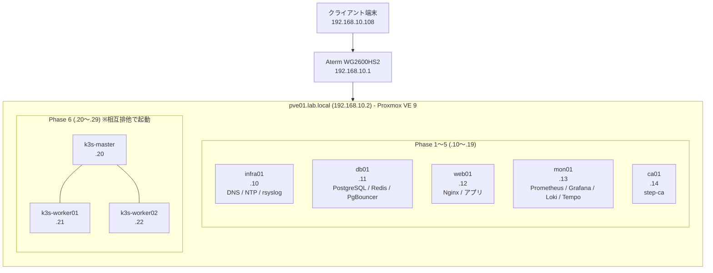

# VM配置図

```mermaid
flowchart TB
    Client[クライアント端末<br/>192.168.10.108]
    Router[Aterm WG2600HS2<br/>192.168.10.1]

    subgraph PVE["pve01.lab.local (192.168.10.2) - Proxmox VE 9"]
        direction TB

        subgraph P15["Phase 1〜5 (.10〜.19)"]
            direction TB
            Infra["infra01<br/>.10<br/>DNS / NTP / rsyslog"]
            DB["db01<br/>.11<br/>PostgreSQL / Redis / PgBouncer"]
            Web["web01<br/>.12<br/>Nginx / アプリ"]
            Mon["mon01<br/>.13<br/>Prometheus / Grafana / Loki / Tempo"]
            CA["ca01<br/>.14<br/>step-ca"]
        end

        subgraph P6["Phase 6 (.20〜.29) ※相互排他で起動"]
            direction TB
            Master["k3s-master<br/>.20"]
            Worker1["k3s-worker01<br/>.21"]
            Worker2["k3s-worker02<br/>.22"]
            Master --- Worker1
            Master --- Worker2
        end
    end

    Client --> Router
    Router --> PVE
```